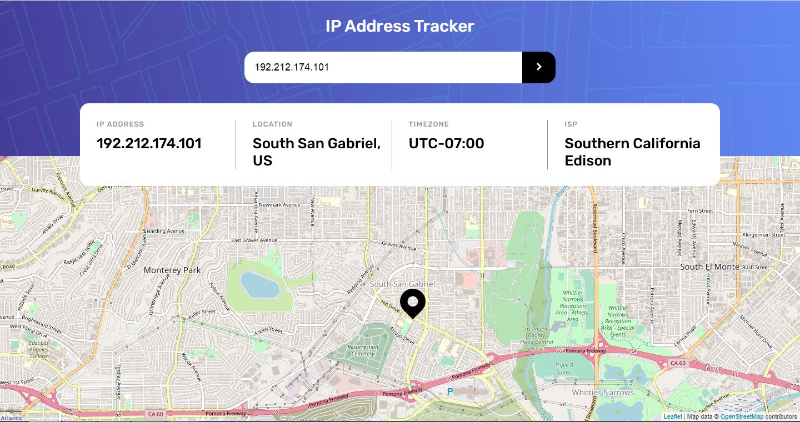

# Frontend Mentor - IP address tracker solution

This is a solution to the [IP address tracker challenge on Frontend Mentor](https://www.frontendmentor.io/challenges/ip-address-tracker-I8-0yYAH0). Frontend Mentor challenges help you improve your coding skills by building realistic projects. 

### The challenge

Users should be able to:

- View the optimal layout for each page depending on their device's screen size
- See hover states for all interactive elements on the page
- See their own IP address on the map on the initial page load
- Search for any IP addresses or domains and see the key information and location

### Screenshot

### Links

- Solution URL: (https://www.frontendmentor.io/solutions/responsive-css-grid-api-yRuxpW9WZ)
- Live Site URL: (https://pedantic-meninsky-61e802.netlify.app/)

### Built with

- Semantic HTML5 markup
- CSS custom properties
- Flexbox
- CSS Grid

### Useful resources

- [Leaflet ](https://leafletjs.com) - An open-source JavaScript library for mobile-friendly interactive maps.
- [ipify API](https://www.ipify.org) - A Simple Public IP Address API.

## Author

- Website - [Ladeia]
- Frontend Mentor - [fladeia](https://www.frontendmentor.io/profile/fladeia)
